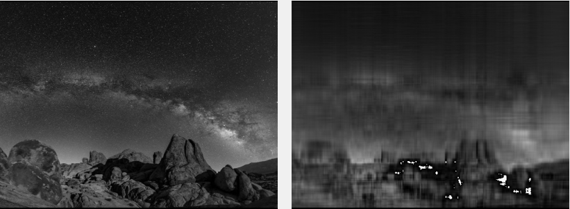
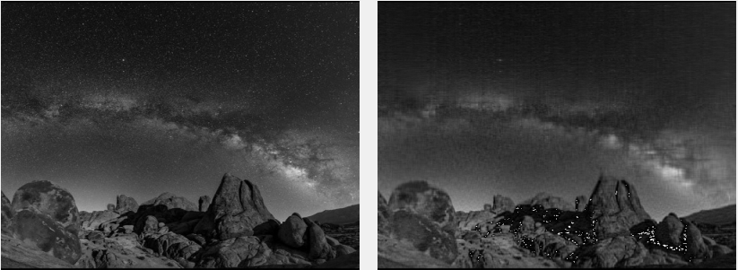
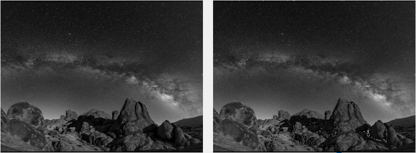
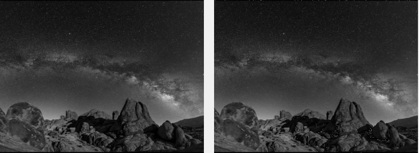

# SVD-Image-Compression
Image compression using Singular value decomposition (SVD).

This was my first attempt at compression any sort of data. I decided to do this project because I was intrigued by one section in my Linear Algebra class, called "SVD Image Compression".

I list the end results of the compression below. There is much more imporvements to be done, like random white dots appearing affter compresison, and compression a simple 500x500 image takes about 19 seconds, while a 1280x720 takes around 2 mins. Most of the computaional time is spent inside 3 for loops, resaulting in O(N3), to solve matrix product. 

## Examples
- Image width, and height is 500.
- Left: Original image
- Right: Compressed image
- K (Number of Singular values)

1. K = 10

2. K = 50

3. K = 150 

4. K = 300

